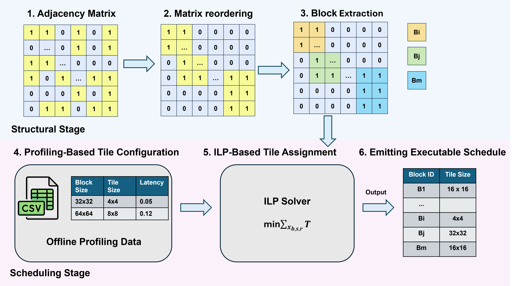
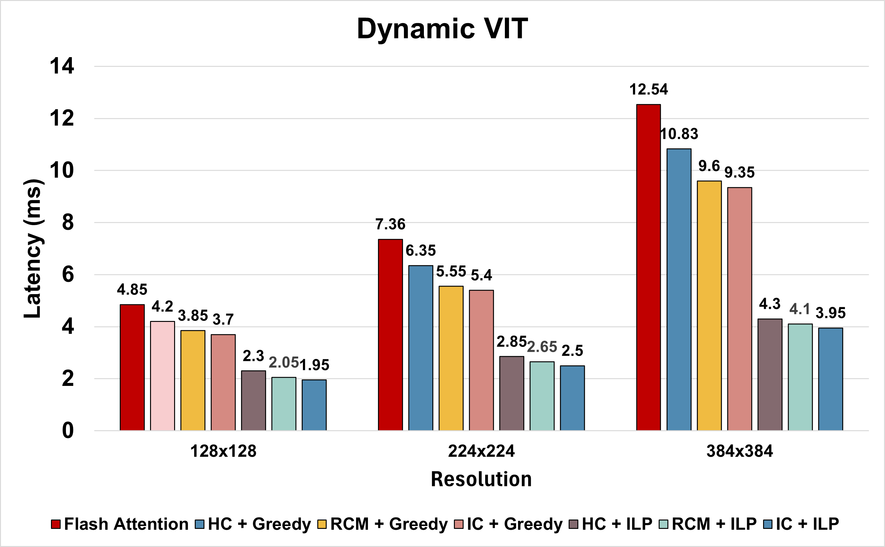
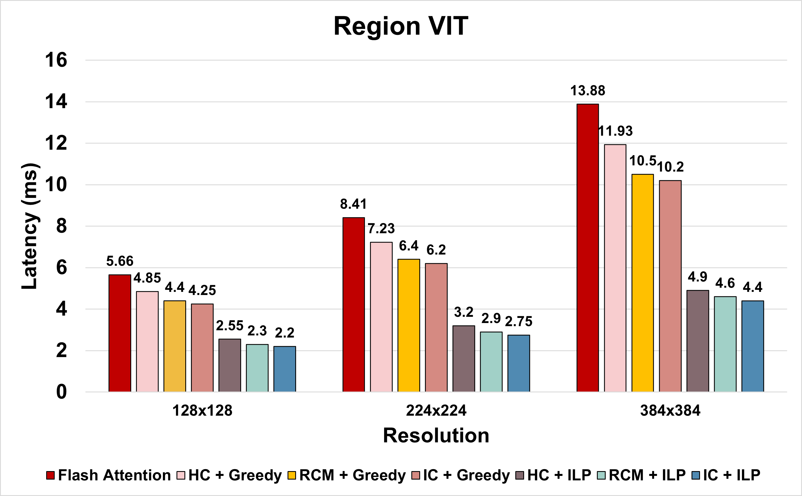
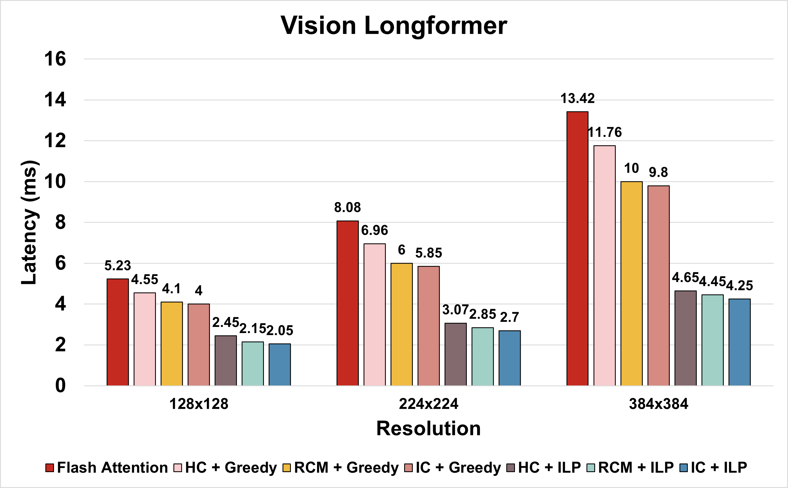
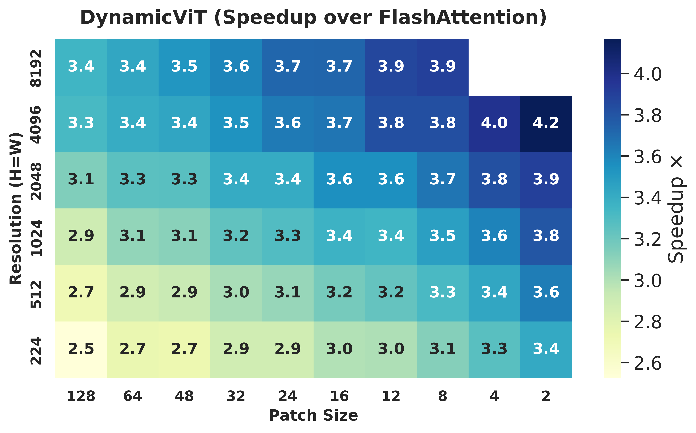

# IPDPS'26 Artifact — Achieving Low Latency Inference on High Resolution Images by Exploiting Sparsity in Vision Transformers

This repository provides the **artifact** for our IPDPS 2026 paper on **constraint-driven, block-wise tile scheduling for sparse attention on GPUs**.

The artifact implements an end-to-end workflow that:
1) constructs sparse attention graphs (adjacency matrices),
2) applies structural reordering (HC / IC / RCM),
3) extracts nearly-dense computation blocks,
4) profiles tile-level latency/resources,
5) solves an ILP (Gurobi) to generate schedules,
6) benchmarks kernels and reproduces paper figures/tables.

The main idea is to convert irregular sparse attention into structured computation blocks that can be efficiently scheduled with hardware-aware optimization.

---

## Repository Structure

```
ipdps-26-vit/
├── README.md
├── requirements.txt
├── environment.yml
│
├── models/
│   ├── DynamicVit/
│   ├── RegionVit/
│   └── VisionLongformer/
│
└── src/
    ├── reorder/
    │   ├── hc.py
    │   ├── ic.py
    │   └── rcm.py
    │
    ├── gen_adj.py
    ├── extract_blocks.py
    ├── solve_ilp_gurobi.py
    └── run_bench.py
```

---

## Contents
- [Contents](#contents)
- [Setup](#setup)
  - [Environment (Conda)](#environment-conda)
  - [Environment (Pip)](#environment-pip)
  - [Gurobi License](#gurobi-license)
- [Usage](#usage)
  - [Full Paper Reproduction](#full-paper-reproduction)
  - [Stage-by-Stage Workflow (T1–T6)](#stage-by-stage-workflow-t1t6)
- [Outputs](#outputs)
- [Reproducibility](#reproducibility)
- [Citation](#citation)
- [Contact](#contact)

---

## Setup

We recommend running on an **Ampere-class GPU** (e.g., NVIDIA A100 80GB). Most scripts will run on smaller GPUs by reducing problem sizes in config files, but full-scale experiments are best reproduced on A100.

### Environment (Conda)

```bash
conda env create -f environment.yml
conda activate ipdps26-vit
```

### Environment (Pip)

If you cannot use conda:

```bash
python -m venv .venv
source .venv/bin/activate
pip install -r requirements.txt
```

> **FlashAttention note:** depending on your system, you may need:
>
> ```bash
> pip install flash-attn --no-build-isolation
> ```

### Gurobi License

The ILP scheduler uses **Gurobi** (via `gurobipy`). Make sure your license is available before running ILP:
- install Gurobi + `gurobipy`
- configure your license (e.g., academic license)
- verify the license works on your machine

## Requirements

- Python 3.9+
- CUDA 12.x
- PyTorch 2.x
- SciPy / NumPy
- Gurobi 10.x (for ILP solving)
- NVIDIA GPU (A100 recommended)
---

## Usage

### Full Paper Reproduction

The full reproduction runs the complete optimization pipeline and regenerates the main results reported in the paper.  
Since each stage is intentionally decoupled, the pipeline is executed sequentially using individual commands.

> Recommended hardware: NVIDIA A100 (80GB).  
> For smaller GPUs, reduce input sizes in your configuration or model settings.

---

### Summary of Workflow
<p align="center">
  
</p>

```
T1: Adjacency Construction
      ↓
T2: Reordering + Block Extraction
      ↓
T3: Tile Profiling
      ↓
T4: ILP Scheduling
      ↓
T5: Benchmarking
      ↓
T6: Analysis / Plotting
```
---

### Stage-by-Stage Workflow (T1–T6)

Each stage can be executed independently. Intermediate outputs are stored under `results/`.

---

#### T1 — Adjacency Construction

Generate sparse attention adjacency matrices from model masks.

```bash
python src/gen_adj.py \
    --model VisionLongformer \
    --output results/graphs/A.npz
```

Output:

```
results/graphs/A.npz
```

---

#### T2 — Graph Reordering + Block Extraction

Apply structural reordering and extract nearly-dense computation blocks.

##### Reordering (choose one)

**IC**

```bash
python src/reorder/ic.py \
    --input results/graphs/A.npz \
    --output results/graphs/A_ic.npz
```

**HC**

```bash
python src/reorder/hc.py \
    --input results/graphs/A.npz \
    --output results/graphs/A_hc.npz
```

**RCM**

```bash
python src/reorder/rcm.py \
    --input results/graphs/A.npz \
    --output results/graphs/A_rcm.npz
```

##### Block Extraction

```bash
python src/extract_blocks.py \
    --input results/graphs/A_ic.npz \
    --output results/blocks/blocks_ic.json
```

Supported reordering methods:

- `rcm` — Reverse Cuthill–McKee (SciPy baseline)
- `hc` — hierarchical clustering reordering
- `ic` — iterative clustering reordering
- `none` — disable reordering

---

#### T3 — Tile Profiling

Profile candidate tile sizes and gather latency/resource statistics for scheduling.

```bash
python src/run_bench.py \
    --profile_only \
    --blocks results/blocks/blocks_ic.json \
    --output results/profiling/profile_ic.json
```

Output:

```
results/profiling/profile_ic.json
```

---

#### T4 — ILP Scheduling (Gurobi)

Solve the hardware-aware tile scheduling problem.

```bash
python src/solve_ilp_gurobi.py \
    --blocks results/blocks/blocks_ic.json \
    --profile results/profiling/profile_ic.json \
    --output results/schedules/schedule_ic.json
```

---

#### T5 — Benchmarking

Execute kernels according to the generated schedule and collect runtime statistics.

```bash
python src/run_bench.py \
    --schedule results/schedules/schedule_ic.json \
    --output results/logs/bench_ic.csv
```

---

#### T6 — Analysis and Figure Generation

The benchmarking stage directly produces raw logs and CSV files that contain latency, throughput, and resource utilization statistics.

```bash
# results are generated automatically during benchmarking
python src/run_bench.py \
    --schedule results/schedules/schedule_ic.json \
    --output results/logs/bench_ic.csv


---


## Example Results

Place representative figures in:

```
figures/
```
---

### End-to-End Speedup

<p align="center">
  
</p>

<p align="center">
  
</p>

<p align="center">
  
</p>


---

### Reordered Sparse Attention Heatmap

<p align="center">
  
</p>

---

## Reproducibility Notes

- Benchmarking uses warmup iterations before timing.
- Multiple runs are averaged for stable measurements.
- FlashAttention kernels may introduce minor non-determinism.


## Citation

If you use this artifact, please cite our paper (BibTeX to be added after publication).

---

## Contact
> Changxin Li, Sanmukh Kuppannagari — Case Western Reserve University
